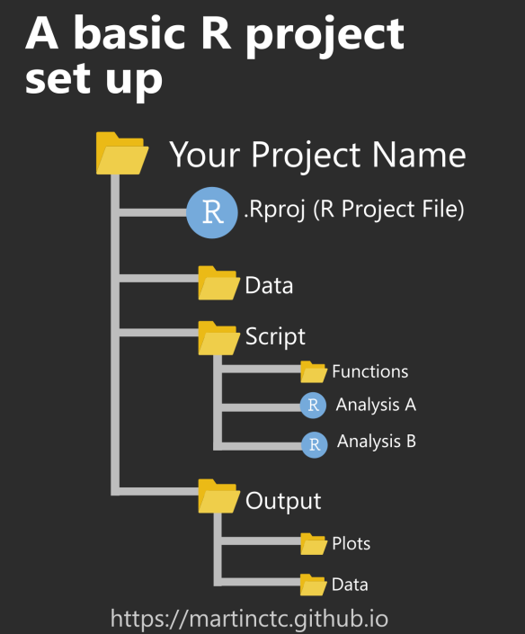
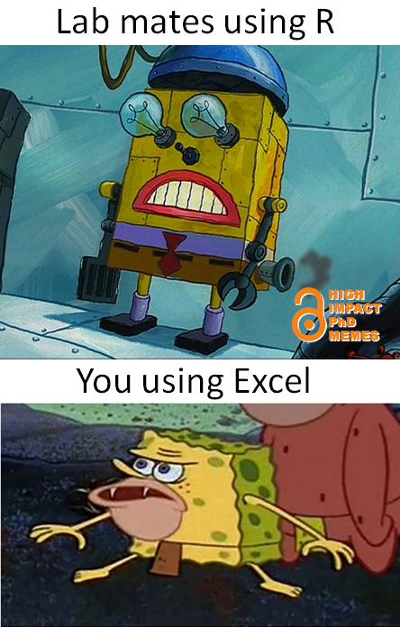
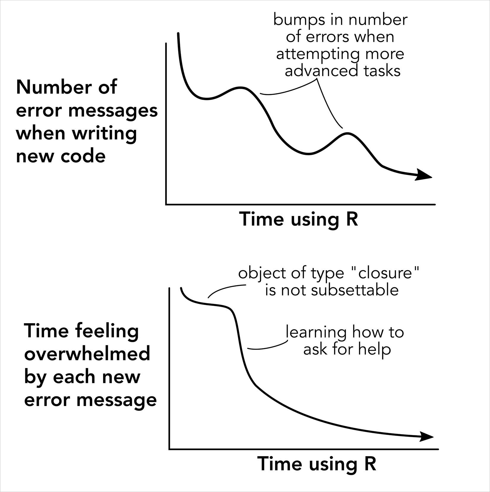
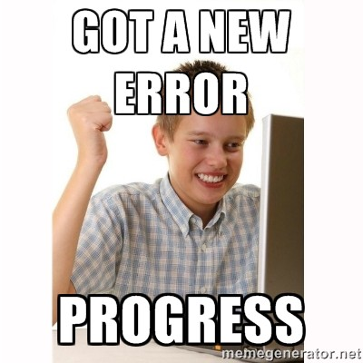

## Introduction to R

### Session 1

Today we will start using **R** and **RStudio**.

We will also create the project folder that we will use throughout the course.

------------------------------------------------------------------------

## What is R?

:::::::: {.columns align="center" totalwidth="8em"}
::: {.column width="40%"}

:::

:::::: {.column width="60%" align="bottom"}
::::: columns
:::: {.column width="80%"}
**R is a language and environment designed for statistical and graphical operations.**

R allows us to work with data by writing code.

::: fragment
That may sound intimidating at first, but the goal is not to become a programmer overnight.
:::
::::
:::::
::::::
::::::::

------------------------------------------------------------------------

## A very short history of R

:::::: columns
:::: {.column width="60%"}
R was developed in the early 1990s by **Ross Ihaka** and **Robert Gentleman**.

It was inspired by an earlier language called **S**.

The problem with S? You had to buy it. And we all know we would rather spend our money on more important things...

::: fragment
Like food 🍔
:::
::::

::: {.column width="30%"}
{fig-align="center" width="65%"}
:::
::::::

------------------------------------------------------------------------

## Why is R useful?

R is:

- **Free**
- **Open source**
- Widely used in science and data analysis
- Supported by a large community
- Extremely flexible

::: fragment
You do not need to learn everything R can do.
:::

::: fragment
You only need to start building the tools that are useful for your own work.
:::

------------------------------------------------------------------------

## What is RStudio?

::::: columns
::: {.column width="55%"}
**R** does the work.

**RStudio** helps us work with R.

RStudio makes it easier to:

- write code
- save scripts
- organize files
- view plots
- install packages
- manage projects
:::

::: {.column width="40%"}
{fig-align="center" width="90%"}
:::
:::::

------------------------------------------------------------------------

## The RStudio interface

{fig-align="center" width="95%"}

------------------------------------------------------------------------

## Console vs. Script

::::: columns
::: {.column width="45%"}
### Console

Good for quick tests.

``` r
2 + 2
```

``` r
10 / 2
```

But Console commands are not automatically saved.
:::

::: {.column width="55%"}
### Script

Better for real work.

``` r
# My first R script

2 + 2
5 * 4
100 / 10
```

Scripts allow us to save, edit, and reuse our code.
:::
:::::

------------------------------------------------------------------------

## First code

Open a new R script:

**File → New File → R Script**

Then write:

``` r
2 + 2
5 * 4
100 / 10
```

Run each line from the script:

**Windows:** `Ctrl + Enter`

**Mac:** `Command + Enter`

------------------------------------------------------------------------

## Comments

We can add notes to scripts using `#`.

``` r
# My first R script

2 + 2

# Multiplication
5 * 4

# Division
100 / 10
```

Anything after `#` is ignored by R.

::: fragment
Comments help your future self understand what your code was doing.
:::

------------------------------------------------------------------------

## RStudio Projects

::::: columns
::: {.column width="55%"}
An RStudio Project connects RStudio with a specific folder on your computer.

That folder can contain everything related to your work:

``` text
my-project/
│
├── data/
├── scripts/
├── outputs/
└── my-project.Rproj
```
:::

::: {.column width="45%"}
{fig-align="center" width="95%"}
:::
:::::

------------------------------------------------------------------------

## Create our course project

Today we will create one project that we will use throughout the course.

Name it:

``` text
intro-r-course
```

Then create three folders:

``` text
intro-r-course/
│
├── data/
├── scripts/
└── outputs/
```

------------------------------------------------------------------------

## Why use projects?

Projects help us avoid this:

``` text
final.csv
final2.csv
final_revised.csv
final_revised2.csv
script.R
script_new.R
figure1.png
```

scattered across:

``` text
Desktop/
Downloads/
Documents/
```

::: fragment
A project gives your work a home.
:::

------------------------------------------------------------------------

## Why learn R?

::::: columns
::: {.column width="52%"}
You may be wondering:

> Why do I need to learn R after spending years getting good at Excel?

A selfish reason:

In many courses, labs, graduate programs, and research projects, knowing some R is already expected.
:::

::: {.column width="48%"}
{fig-align="center" width="85%"}
:::
:::::

------------------------------------------------------------------------

## Good reasons to learn R

- **Reproducibility**\
  You can save and share exactly what you did.

Not just so that someone can replicate it exactly and know whether it's right or wrong, but also so that others can learn from it.

{fig-align="center"}

------------------------------------------------------------------------

- **It's like learning a language**\
  It exercises your brain and helps you improve your quantitative reasoning. That's not just my opinion—science says so [@auker2020].

{fig-align="center"}

------------------------------------------------------------------------

- **A new skill in your arsenal**\
  Programming skills are increasingly in demand and highly valued [@lai2019]. Not only in academia but also in industry, knowing how to handle, visualize, and analyze data can be a huge advantage [@feng2020]. I’m not saying everyone has to be an expert, but everyone should at least have a basic understanding.

  {fig-align="center"}

------------------------------------------------------------------------

- **(Almost) endless possibilities**\
  These days, R isn’t just for statistics, you can do so many things with it. From documents and infographics to memes (yes, there’s even a package for making memes). Personally, I’ve learned the most about R when I combine it with my hobbies, creating graphs, exploring time-series data, music, and even politics, among other things.

{fig-align="center"}

<https://cran.r-project.org/web/packages/meme/vignettes/meme.html>

------------------------------------------------------------------------

## What can you do with R?

::::: columns
::: {.column width="50%"}
### Data

Clean, organize, and explore datasets.

### Statistics

Fit simple and complex models.

### Graphics

Create figures, maps, and animations.
:::

::: {.column width="50%"}
### Documents

Create reports, websites, presentations, and manuscripts.

### Apps

Build interactive tools to explore data.

### Automation

Avoid doing repetitive tasks by hand.
:::
:::::

------------------------------------------------------------------------

## The R community

{fig-align="center" width="70%"}

R has a large and generous community.

There are tutorials, books, forums, examples, packages, and people willing to help.

------------------------------------------------------------------------

## You will not learn R today

::::: columns
::: {.column width="55%"}
R is learned by practicing.

You will:

- make mistakes,
- get errors,
- forget commands,
- reuse old scripts,
- search for help,
- and slowly become more comfortable.
:::

::: {.column width="45%"}
{fig-align="center" width="90%"}
:::
:::::

------------------------------------------------------------------------

## Errors are part of learning R

You are going to see errors.

::::: columns
::: {.column width="40%"}

:::

::: {.column width="55%"}
A lot of them.

::: fragment
That is normal.
:::

::: fragment
R is not about avoiding errors.
:::

::: fragment
It is about making enough of them that you eventually learn how to fix them.
:::
:::
:::::

------------------------------------------------------------------------

## Learning R takes time

In conclusion, whether or not you learn R will depend on how much [**time**]{.underline} **you spend on it**, not on whether or not you take this tutorial. [@lawlor2022]

{width="642"}

------------------------------------------------------------------------

## Practice at home

Before the next session:

1. Open your `intro-r-course` project.
2. Create a new R script.
3. Save it in `scripts/` as:

``` text
practice-01.R
```

4. Write and run at least 20 simple calculations.
5. Add comments using `#` explaining each line of code you wrote, the title of the script, and your name.
6. Close RStudio and reopen the project using the `.Rproj` file.

------------------------------------------------------------------------

## Keep writing code

The easiest way to learn R is to use it.

You do not need to memorize every command.

Write code, make mistakes, modify examples, and keep your old scripts.
